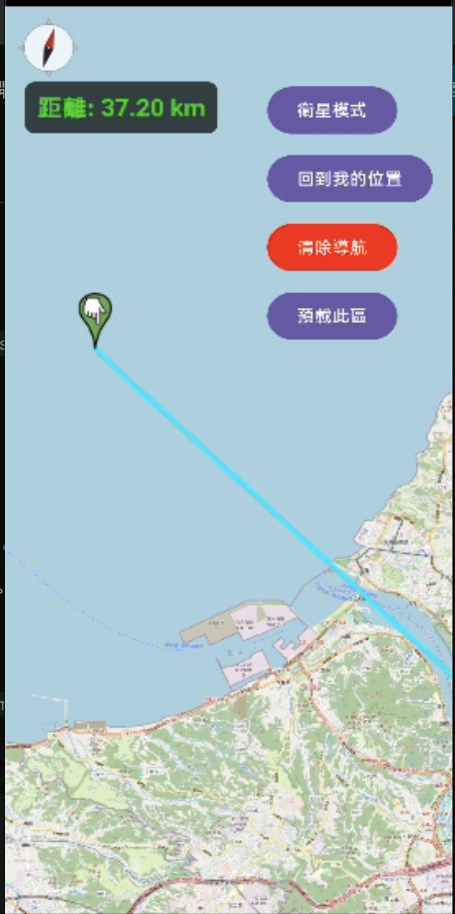
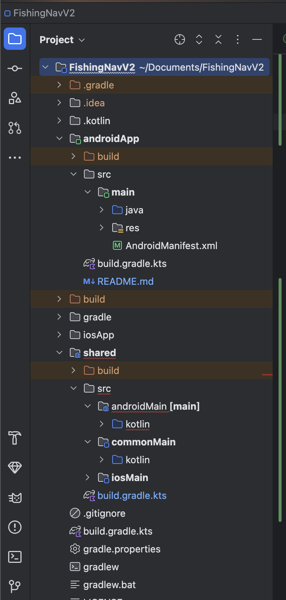
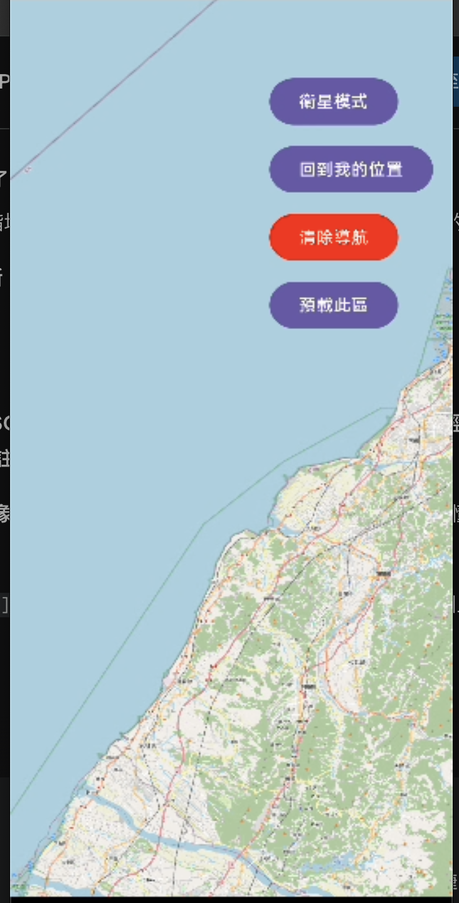

# FishingNav KMP - 離線航海導航系統

本專案採用 **Kotlin Multiplatform (KMP)** 架構開發，專為漁船在海上無網路環境下的導航、漁標記錄與安全監控設計。

## 🛠 技術亮點
* **KMP 跨平台架構**：實現 Android/iOS 核心邏輯共享，包含地理座標計算與資料模型管理。
* **離線地圖引擎 (OSMDroid)**：整合 OSMDroid 框架，支援 MBTiles 離線圖資渲染，確保海上導航不中斷。
* **精準定位系統**：串接 GPS/AGPS 並實作即時座標校正，優化海上弱訊號環境的定位表現。
* **現代化 UI 實作**：全專案採用 Jetpack Compose 編寫，具備流暢的互動體驗與地圖圖層切換功能。

## 📸 開發驗證 (實機運行與數據監控)
| 實機導航介面渲染 | KMP 架構與即時定位數據 | 風場邊界同步結果 |
| :--- | :--- | :--- |
|  |  |  |

## 🛠️ 核心技術突破 (政府數據整合)
針對「臺灣離岸風電地理與環境感知系統」之 Open Data 串接，本專案成功解決以下技術挑戰：
* **複雜空間幾何解析**：處理 GeoJSON 中 `Polygon` 格式之多層巢狀 `coordinates` 結構 (三層陣列 [[[...]]])，實現精確的區域邊界渲染。
* **KMP 型別安全性處理**：解決 Kotlinx Serialization 在處理動態型別時的 `JsonPrimitive` 轉換挑戰，確保跨平台網路層之穩定性。
* **高效能地圖渲染**：透過 OSMdroid `Polygon` 覆蓋層 (Overlay)，實現大量空間邊界數據在行動裝置上的流暢呈現。

## 🏗 目前開發狀態
- [x] 跨平台 KMP 專案基礎環境架構建置
- [x] OSMDroid 離線地圖底層渲染引擎
- [x] 實時方位校正與距離計算演算法
- [x] 行政院政府 Open Data 風場資訊自動同步 (已完成實作)
- 
---

## 📄 授權與聲明 (License & Disclaimer)

* **版權所有**：© 2026 Ella Liu. All rights reserved.
* **僅供面試展示**：本專案程式碼與架構僅作為個人技術作品集與面試展示使用，未經許可不得擅自轉載、重製或用於商業用途。
* **第三方資源**：地圖資料來源於 [OpenStreetMap](https://www.openstreetmap.org/)，政府資料來源於 [臺灣離岸風電地質與環境感知系統API服務供應平臺](https://windpower.geologycloud.tw/swagger/api-docs/api?utm_source=chatgpt.com#/%E7%B6%93%E6%BF%9F%E6%B4%BB%E5%8B%95/post_data_Economy_wpzone_approved)。
